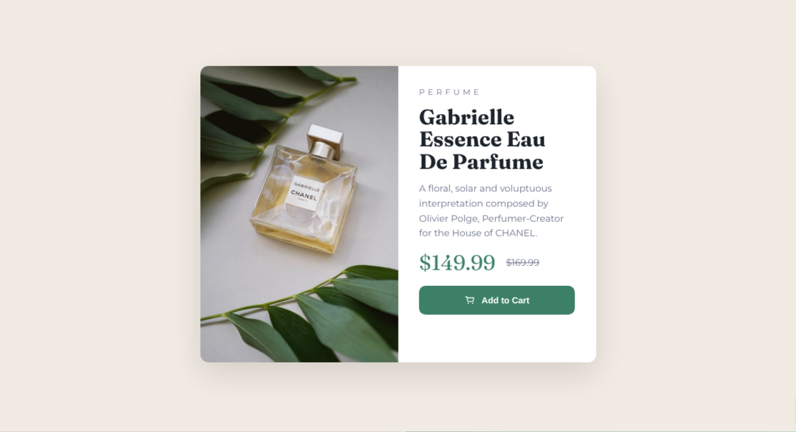
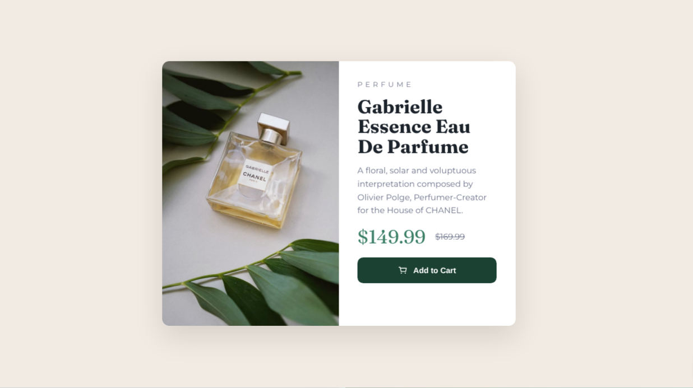

# Frontend Mentor - Product preview card component solution

This is a solution to the [Product preview card component challenge on Frontend Mentor](https://www.frontendmentor.io/challenges/product-preview-card-component-GO7UmttRfa). Frontend Mentor challenges help you improve your coding skills by building realistic projects.

## Table of contents

- [Overview](#overview)
  - [The challenge](#the-challenge)
  - [Screenshot](#screenshot)
  - [Links](#links)
- [My process](#my-process)
  - [Built with](#built-with)
  - [What I learned](#what-i-learned)
  - [Continued development](#continued-development)
  - [Useful resources](#useful-resources)
- [Author](#author)
- [Acknowledgments](#acknowledgments)

## Overview

### The challenge

Users should be able to:

- View the optimal layout depending on their device's screen size
- See hover and focus states for interactive elements

### Screenshot

Desktop preview:



Active/hover state preview:



### Links

- Solution URL: [GitHub Repo URL](https://github.com/whitgunt77/product-preview-card)
- Live Site URL: [Live Site Preview URL](https://whitgunt77.github.io/product-preview-card/)

## My process

### Built with

- Semantic HTML5 markup (`main`, `article`, headings, accessible button)
- CSS custom properties (colors + spacing tokens)
- Flexbox & CSS Grid (layout + alignment)
- Mobile-first workflow
- Responsive images using `background-image` + media queries
- Accessible focus states using `:focus-visible`

### What I learned

This project helped me practice building a clean, responsive component using a mobile-first approach.

Key takeaways:

- Designing the card layout with a single-column mobile layout first, then switching to a 2-column grid on larger screens
- Creating consistent spacing and theming using CSS variables
- Adding polished interactivity with hover and keyboard focus states

Example focus styling I used:

```css
.btn:focus-visible {
  outline: 3px solid rgba(26, 64, 50, 0.35);
  outline-offset: 3px;
}
```

### Continued development

Next, I want to keep improving:

- Component structure patterns I can reuse across projects
- More advanced responsive image techniques (like `picture` + `srcset`)
- Accessibility details improved contrast checks and more robust focus rings

### Useful resources

- [MDN - :focus-visible](https://developer.mozilla.org/en-US/docs/Web/CSS/:focus-visible) - This helped me add a keyboard-only focus style without showing it on mouse clicks.
- [CSS Tricks - A Complete Guide to Grid](https://css-tricks.com/complete-guide-css-grid-layout/) - This is a great reference for switching layouts at breakpoints.

## Author

- Frontend Mentor - [@whitgunt77](https://www.frontendmentor.io/profile/whitgunt77)

## Acknowledgments

Shout-out to Frontend Mentor for the design + requirements that made this a fun layout challenge.
